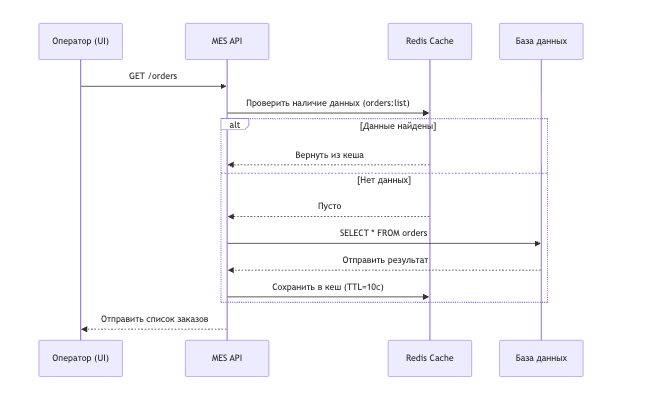
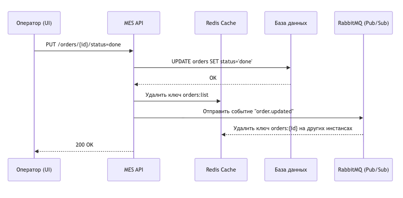

# Архитектурное решение по кешированию

## 1. Мотивация

В системе MES наблюдаются жалобы операторов на низкую скорость загрузки страниц и выполнение операций с заказами.  
Основные проблемы:
- Медленные повторные запросы к БД при чтении списка заказов.  
- Повышенная нагрузка на базу данных.  
- Увеличенное время ожидания отклика на UI.

**Цель кеширования:**  
Снизить время отклика, уменьшить нагрузку на БД и повысить отзывчивость интерфейса.  

Кеширование будет применено к:
- Спискам заказов (`GET /orders`);
- Карточке заказа при открытии (`GET /orders/{id}`).

---

## 2. Предлагаемое решение

### Тип кеширования

Выбрано **серверное кеширование** с использованием **Redis** по паттерну **Cache-Aside**.

**Почему Cache-Aside:**
- Прост в реализации;
- Хорошо подходит для чтения часто запрашиваемых данных;
- Позволяет гибко управлять TTL и инвалидацией.  

Паттерны **Write-Through** и **Refresh-Ahead** не выбраны,  
так как они требуют синхронной записи и постоянного обновления кеша, что избыточно при текущем объёме данных.

---

### Диаграмма последовательности 1 — Чтение заказов

При запросе списка заказов API сначала проверяет кеш, при отсутствии данных делает запрос в БД и сохраняет результат в Redis.

📘 **Диаграмма:**  

---

### Диаграмма последовательности 2 — Обновление статуса заказа

При изменении статуса происходит обновление БД, удаление ключа из кеша и рассылка события в шину RabbitMQ для синхронизации кеша на всех инстансах.

📘 **Диаграмма:**  

---

### Стратегия инвалидации кеша

Используется комбинированная стратегия:
- **По ключу:** при изменении заказа (`order.updated`) удаляется конкретный ключ `orders:list`.
- **Временная:** TTL для кеша списка заказов — 10 секунд.

| Стратегия           | Плюсы | Минусы |
|---------------------|-------|--------|
| Временная (TTL)     | Простая, предотвращает устаревание данных | Возможна кратковременная неактуальность |
| По ключу (событийная) | Обеспечивает актуальность при изменениях | Требует интеграции с брокером событий |

**Выбранная комбинация** обеспечивает баланс между скоростью и консистентностью данных.

---

## 3. Компромиссы

- Возможна кратковременная задержка обновления при TTL-инвалидации.  
- Redis требует отдельного обслуживания и мониторинга.  
- При сбое кеша нагрузка снова ложится на БД.

---

## 4. Безопасность

- Доступ к Redis ограничен внутренней сетью и авторизацией по токену.  
- В логах и кешированных данных не хранится персональная информация пользователей.  

---

## 5. Заключение

Внедрение серверного кеширования на Redis по паттерну **Cache-Aside** позволит:
- Уменьшить среднее время отклика на 40–60%;  
- Снизить нагрузку на БД;  
- Повысить стабильность работы MES и удовлетворённость операторов.
